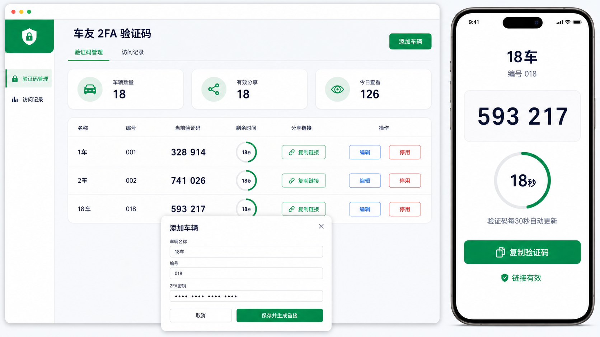
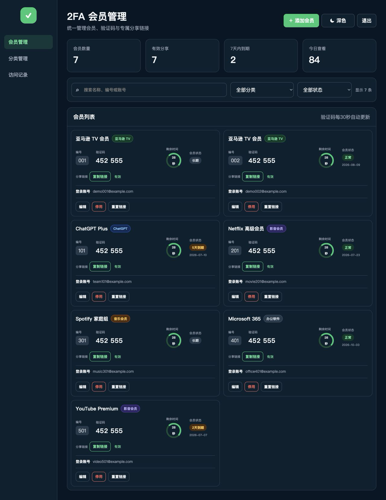
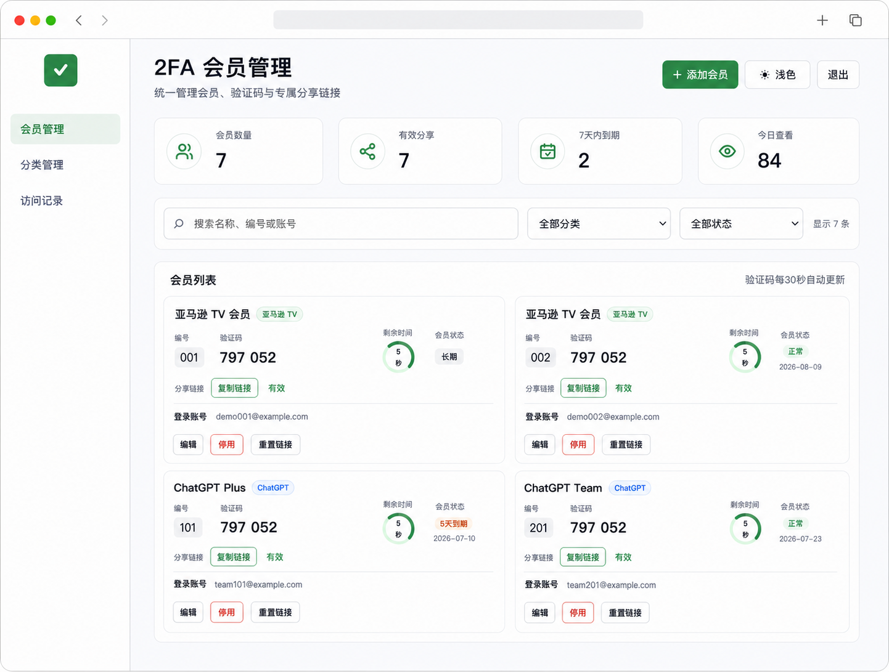

# 2FA 验证码共享看板

一个适合私有部署的 TOTP/2FA 会员管理工具。管理员保存授权账号的 Base32 密钥后，系统自动生成六位验证码和独立分享链接；使用者打开链接即可查看当前验证码，不必再等管理员手动转发。

> 仅用于你有权管理的共享账号或服务账号。分享链接本身属于敏感凭据，请勿公开传播。

## 在线演示

安装前可以先体验纯浏览器演示版：

**[打开在线演示](https://newszx.github.io/totp-share-dashboard/)**

```text
账号：admin
密码：demo123
```

演示版按照当前正式版界面模拟登录、会员卡片、分类与状态筛选、添加会员、实时验证码、主题切换和分享页面。它完全在浏览器内运行，不需要服务器或数据库。

> 演示版的数据只保存在当前浏览器，分享链接中的测试数据不具备正式版的服务端加密、远程撤销和访问日志能力。请勿录入真实账号或真实 2FA 密钥；正式使用请按下方说明私有部署。

首次发布时，在仓库 **Settings → Pages → Build and deployment** 中选择 **Deploy from a branch**，分支选择 `main`，目录选择 `/docs`。此后更新 `docs/` 内的演示页面会自动发布。

## 界面预览

### 深色模式



### 浅色模式



## 主要功能

- 会员名称、编号、账号、分类、到期时间和备注
- 名称/编号/账号搜索，分类和状态筛选
- 六位 TOTP 验证码与 30 秒倒计时
- 每位会员独立、随机、可撤销的分享链接
- 浅色、深色、跟随系统三种主题
- 访问记录、到期提醒和分享状态管理
- 2FA 原始密钥加密保存，浏览器无法取得原始密钥
- Docker Compose + SQLite，无需另外安装数据库

## 一键部署

服务器需先安装 Git、Docker、Docker Compose、OpenSSL 和 curl。使用 `root` 用户执行：

```bash
curl -fsSL https://raw.githubusercontent.com/Time999-1/totp-share-dashboard/main/install.sh -o /tmp/install-totp-dashboard.sh \
  && bash /tmp/install-totp-dashboard.sh
```

脚本会自动：

1. 安装或更新项目到 `/opt/totp-share-dashboard`
2. 首次部署时生成管理员密码和随机安全密钥
3. 构建并启动 Docker 容器
4. 检查服务是否正常运行
5. 安装 `totp-dashboard` 管理命令

首次安装后查看账号密码：

```bash
sudo totp-dashboard initial-password
```

管理员账号默认为 `admin`。确认保存密码后，可删除服务器上的初始密码明文：

```bash
sudo rm -f /root/totp-share-dashboard-admin-password.txt
```

## 1Panel 配置

在 1Panel 中创建反向代理：

```text
代理地址：http://127.0.0.1:8787
```

绑定域名、申请 SSL 证书并开启 HTTPS，然后访问：

```text
https://你的域名/login
```

不要在 1Panel 中重复启动同一个 Compose 项目；SSH 部署后，1Panel 只负责域名、反向代理和 HTTPS。

## 常用管理命令

```bash
# 查看运行状态
sudo totp-dashboard status

# 一键更新
sudo totp-dashboard update

# 修改或忘记管理员密码
sudo totp-dashboard password

# 查看最近 100 行实时日志
sudo totp-dashboard logs

# 重启服务
sudo totp-dashboard restart

# 查看全部命令
sudo totp-dashboard help
```

网站首次启动后，密码已加密写入数据库。此后只修改 `.env` 中的 `ADMIN_PASSWORD` 不会生效，请使用 `sudo totp-dashboard password`。

## 手动部署

```bash
cd /opt
git clone https://github.com/Time999-1/totp-share-dashboard.git
cd totp-share-dashboard
cp .env.example .env
```

生成安全密钥并编辑管理员密码：

```bash
sed -i "s/^SESSION_SECRET=.*/SESSION_SECRET=$(openssl rand -hex 32)/" .env
sed -i "s/^APP_ENCRYPTION_KEY=.*/APP_ENCRYPTION_KEY=$(openssl rand -hex 32)/" .env
nano .env
docker compose up -d --build
curl http://127.0.0.1:8787/health
```

健康检查返回 `{"status":"ok"}` 即表示部署成功。正式环境应保持 `COOKIE_SECURE=true`，并通过 HTTPS 访问。

## 数据备份

必须同时备份 `.env` 和数据库；缺少 `.env` 中的 `APP_ENCRYPTION_KEY` 将无法解密已有 2FA 密钥。

```bash
cd /opt/totp-share-dashboard
cp .env .env.backup
docker cp totp-share-dashboard:/app/data/totp.db ./totp.db.backup
```

## 安全说明

- 分享链接使用随机令牌，可以随时停用或重置。
- 密钥使用 Fernet 对称加密后保存。
- 管理后台需要登录，并包含 CSRF 防护与接口限速。
- 管理页和分享页禁止搜索引擎收录。
- 建议定期检查访问记录，链接泄露后立即重置。
- `APP_ENCRYPTION_KEY` 部署后不要修改。

## 技术栈

Python / Flask · pyotp · SQLite · Gunicorn · Docker Compose
